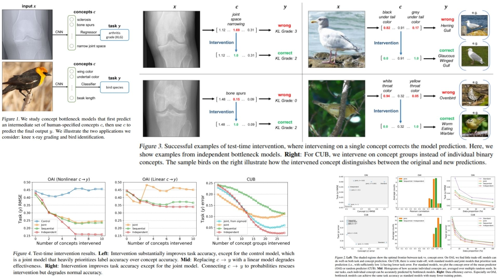

# 🌮 ConceptBottleneck-Replication – Interpretable Neural Reasoning via Concepts

This repository provides a **PyTorch-based replication** of  
**Concept Bottleneck Models – Koh et al., ICML 2020**.

The focus is **translating the theoretical concept bottleneck framework into a clean, modular, and practical architecture**,  
rather than chasing benchmark SOTA results.

- Learns **human-interpretable concepts** as an intermediate representation 🧩  
- Enables **direct concept intervention and counterfactual reasoning** 🧪  
- Modular & lightweight, **plug-and-play for any encoder backbone** 🛠️  

**Paper reference:** [Concept Bottleneck Models – Koh et al., 2020](https://arxiv.org/abs/2007.04612) 📄

---

## 🧠 Overview – Concept Bottleneck Pipeline



The core idea:

> Force the model to reason through **human-specified concepts** before making a final prediction.

Instead of learning a black-box mapping  
$x \rightarrow y$,  
the model is structured as:

$$
x \;\longrightarrow\; c \;\longrightarrow\; y
$$

Where:
- $x$ = raw input (image, signal, etc.)
- $c$ = vector of interpretable concepts (bone spur, wing color, beak shape, …)
- $y$ = final prediction (disease grade, bird species, …)

This creates a **bottleneck**: the model is forced to explain itself in terms of concepts.

---


## 🧮 CBM Computation – Math Essentials

### Concept Prediction (x → c)

Given input $x$ and encoder $E$:

$$
h = E(x), \quad \hat{c} = g(h)
$$

Where:
- $h \in \mathbb{R}^d$ is feature representation  
- $\hat{c} \in \mathbb{R}^k$ is predicted concept vector  

Each dimension corresponds to one human-defined concept.


### Decision Layer (c → y)

Final prediction is made **only using concepts**:

$$
\hat{y} = f(\hat{c})
$$

This guarantees that:
> The model cannot bypass the concepts.

All reasoning must pass through the bottleneck.


### Joint Bottleneck Loss

Training objective:

$$
\mathcal{L} = \mathcal{L}_Y(f(g(x)), y) + \lambda \sum_{j=1}^k \mathcal{L}_{C_j}(g_j(x), c_j)
$$

Special cases:
- $\lambda \to 0$ → standard black-box model  
- $\lambda \to \infty$ → strict concept supervision  

---

## 🧪 Concept Intervention – Model Surgery

One of the defining features of CBMs is **intervention**.

At test time, we can:
1. Predict concepts
$$\hat{c} = g(x)$$  
3. Manually edit a concept:
$$\hat{c}_j \leftarrow c_j^\text{new}$$
4. Recompute prediction:
$$\hat{y}_\text{new} = f(\hat{c})$$

This enables:

- Counterfactual reasoning  
- Human-in-the-loop correction  
- Debugging concept failures  
- Interpretability via causal probing  

Example:
> “If the model did not think there was a bone spur, would it still predict severe arthritis?”

CBMs can answer this directly.

---

## 🧠 What the Model Enables

- Explicit reasoning via **human concepts**
- Direct **model introspection**
- Concept-level debugging
- Counterfactual explanations
- Robustness via semantic supervision
- Human-model collaboration

The model is **interpretable by construction**.

---

## 📦 Repository Structure

```bash
ConceptBottleneck-Replication/
├── src/
│   ├── backbone/
│   │   └── encoder.py          # Feature extractor (CNN / MLP)
│   │
│   ├── concepts/
│   │   └── concept_head.py     # g(x): feature → concept vector
│   │
│   ├── decision/
│   │   └── classifier.py      # f(c): concept → output
│   │
│   ├── model/
│   │   └── cbm.py             # Full x → c → y model
│   │
│   ├── loss/
│   │   └── cbm_loss.py        # Joint bottleneck loss
│   │
│   ├── intervention/
│   │   └── intervene.py      # Concept editing & forward
│   │
│   └── config.py             # concept_dim, lambda, hidden_dim, etc.
│
├── images/
│   └── figmix.jpg             # CBM overview figure
│
├── requirements.txt
└── README.md
```
---


## 🔗 Feedback

For questions or feedback, contact: [barkin.adiguzel@gmail.com](mailto:barkin.adiguzel@gmail.com)
